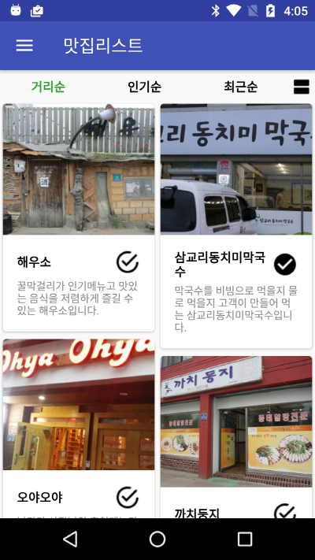
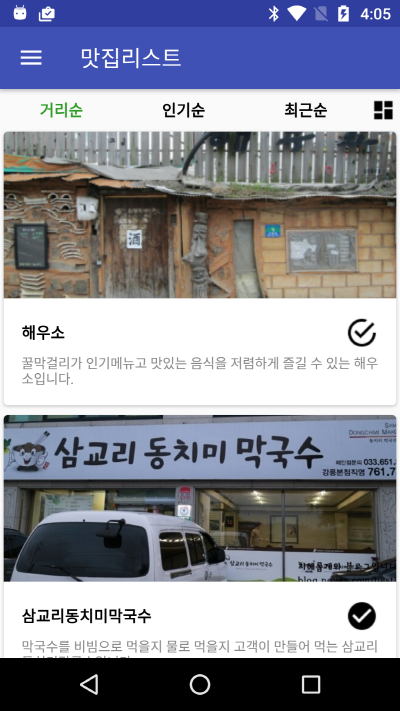
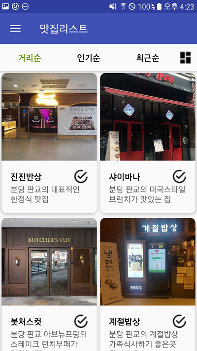
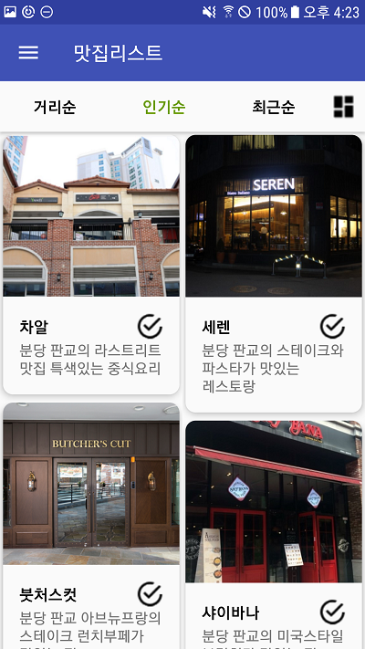
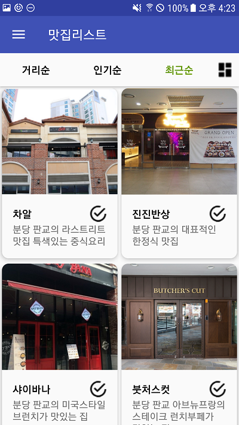
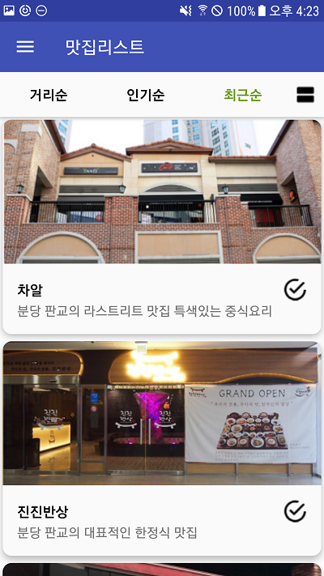

"# Boostcamp-mini2" 

# 안드로이드 2주차 미니 프로젝트

## 1. 프로젝트 개요
지금까지 배운 지식을 활용하여 맛집 리스트 화면을 구성한다. 이를 통해 리사이클러뷰와 카드뷰를 사용하는 방법을 연습하고 데이터를 처리하는 방법에 대해 고찰하는 시간을 가진다.
 
## 2. 체크 포인트
* 화면을 동일하게 구성하였는가?
* 맛집 리스트를 리사이클러뷰와 카드뷰를 사용해서 보여주고 있는가?
* 툴바를 사용하여 화면을 구성하였는가?
* 오른쪽 상단 오른쪽의 아이콘을 클릭하여 화면 구성을 변경할 수 있는가?
* '거리순', '인기순', '최근순'을 클릭했을 때, 저장된 데이터를 기반으로 새롭게 정렬해서 보여줄 수 있는가?
* 체크박스를 클릭했을 때, 이를 표시하고 이 값이 앱을 종료되기 전까지 유지되는가?

## 3. 기본 화면 구성 예시
 

## 4. 작업 결과
 
 

* 주어진 예시를 고려하여 제작
* 탭 마다 아이템의 데이터를 기반으로 새롭게 정렬
* 버튼 클릭시 LayoutManager 변경을 통한 화면 재구성
* 체크 박스 클릭시 값 토글 및 값 유지