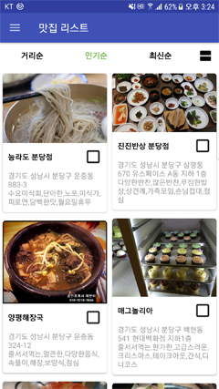
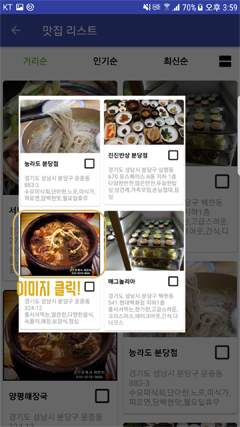
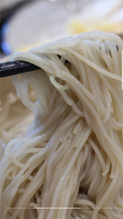
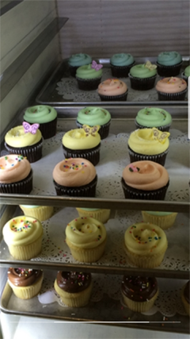

# 안드로이드 미니프로젝트 2

 

  
  
   
  <b>[실행 화면]</b>

 

## 1. 개요
맛집 리스트를 Grid형식과 Linear 형식으로 보여주고 거리순, 인기순, 최신순으로 정렬하는 기능을 포함하는 미니프로젝트  

 

  
  
   
  <b>[이미지 클릭]</b>

 

## 2. 설명
* 거리순, 인기순, 최신순 탭을 클릭하면 아이템이 정렬됩니다.
* 탭 우측의 이미지를 클릭하면 아이템의 보기 형식이 달라집니다.
* 아이템의 이미지를 클릭하면 확대해서 볼 수 있습니다.
* 이미지 확대 시 휴대폰을 좌,우로 움직이면 파노라마 형식으로 이미지를 볼 수 있습니다.
